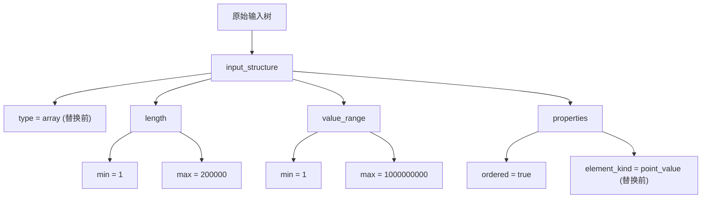
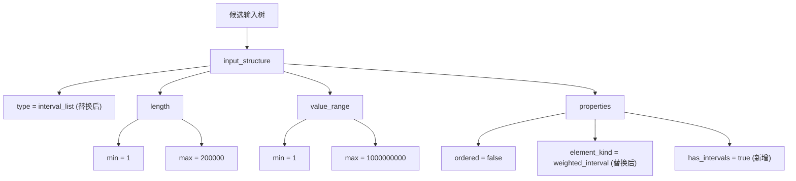

# 生成题面

该目录实现了“规则驱动的四元组生成器”。当前版本采用“规则声明 + 代码执行”架构：规则文件负责声明元信息、审计标签与合同入口，`rule_handlers.py` 负责组织资格判断、规划校验、题面校验与审计事件生成。资格判断阶段会先调用 LLM，并通过角色审查式提示词完成单规则准入审查；规划校验和题面校验会先经过代码级通用硬门槛，再由每条规则各自的 LLM 审查提示词完成专属语义审查。默认输入来自 `D:/AutoProblemGen/四元组抽取/output/batch/normalized/*.json`，生成链路围绕四元组 `input_structure / core_constraints / objective / invariant` 展开，输出包括：

- `output/<problem_id>/*.md`：最终 Markdown 题面；`same_family` 模式使用 `output/<seed_a>__<seed_b>/`
- `artifacts/<problem_id>/*.json`：规则决策轨迹、实例化四元组、模型返回结果与迭代摘要；`same_family` 模式使用 `artifacts/<seed_a>__<seed_b>/`
- `reports/<problem_id>/*.md`：单题人工排查报告。成功题会对比原题与新题四元组，失败题会给出失败原因、原题四元组与候选规则结论；`same_family` 模式使用 `reports/<seed_a>__<seed_b>/`
- `artifacts/batch_*.json`：目录批量生成时的整批汇总

## 流程

1. 读取上游四元组 schema
2. 根据 `mode` 与 `planning_rules.json` 整理可用规则
3. 先由 LLM 按角色提示词完成单规则资格审查，再由 handler 解释审查结果并进入排序式规则选择
4. 按候选顺序规划，先执行代码级通用硬门槛，再执行规则专属 LLM 规划审查；首选失败时会自动回退到下一候选
5. 把规划结果交给题面生成阶段，要求模型输出严格 JSON，并在通用结构校验后执行规则专属 LLM 题面审查
6. 若启用质量闭环，调用 `题目质量评价` 生成质量报告，并把此前所有结构化 `revision_brief` 的累积上下文回流给下一轮规划和题面生成
7. 渲染为标准 OJ 风格 Markdown，并把 artifact、质量报告、过程报告与迭代摘要落盘

当前启用的模式只有两种：

- `single_seed_extension`
- `same_family_fusion`

`cross_family_fusion` 仅在规则文件中保留占位，本轮不支持运行。

## 运行

安装依赖：

```bash
pip install -r requirements.txt
```

配置环境变量。运行时只读取 [生成题面/.env](/D:/AutoProblemGen/生成题面/.env) 中的这些值。可直接参考 [生成题面/.env.example](/D:/AutoProblemGen/生成题面/.env.example)：

```dotenv
DASHSCOPE_API_KEY=your_key
QWEN_BASE_URL=https://dashscope.aliyuncs.com/compatible-mode/v1
QWEN_MODEL=qwen3.5-plus
QWEN_EMBEDDING_MODEL=text-embedding-v4
QWEN_TIMEOUT_S=180
```

单题扩展：

```bash
python main.py --mode single --problem-ids CF25E CF360C --variants 2
```

目录批量生成：

```bash
python main.py --mode single --source-dir D:/AutoProblemGen/四元组抽取/output/batch/normalized
```

同类融合：

```bash
python main.py --mode same_family --seed-a CF25E --seed-b CF360C --variants 1
```

指定规则：

```bash
python main.py --mode single --problem-ids CF25E --rule-override canonical_witness
```

自定义超时：

```bash
python main.py --mode single --problem-ids CF25E --timeout 360
```

启用最多 3 轮的质量闭环：

```bash
python main.py --mode single --problem-ids CF25E --quality-iterations 3
```

当 `single` 模式省略 `--problem-ids` 时，系统会把 `--source-dir` 当前层级下的全部 `*.json` 文件视为一批任务，按文件名字典序逐个生成。批量模式要求每个文件显式提供 `problem_id`，并且该值必须与文件名一致。若中途某一题在规划、生成或落盘阶段报错，该题会被记为失败并写入批量汇总，后续题目继续执行；此前已经成功落盘的结果会保留，单题产物继续按题目子目录写入，同时额外在 `artifacts/` 根目录写出 `batch_*.json` 作为整批汇总。

`--quality-iterations` 只对 `single` 模式生效：

- `0`：关闭质量闭环，保持旧行为
- `1`：生成 1 轮并产出质量报告与迭代摘要
- `2`、`3`：分别表示正常质量闭环最多执行 2 轮或 3 轮；若任一轮 `reject_invalid`、`schema_insufficient` 或 `difference_insufficient`，流程会提前停止

当某轮 `overall.status` 为 `pass` 时，系统还会检查五个质量维度 `variant_fidelity`、`spec_completeness`、`cross_section_consistency`、`sample_quality`、`oj_readability` 是否全部为 5 分。若未满分，会进入满分打磨阶段：复用同一个 `new_schema` 与上一轮规划，不再重新规划，只重写题面内容并继续评测；追加轮数由 `--quality-full-score-max-iterations` 控制。

运行过程中，控制台会输出当前阶段提示，包括参数校验、进入流水线、当前题、当前 variant、规划、题面生成、产物写入与批量完成状态。

## CLI

`main.py` 当前支持的 CLI 参数如下。

| 参数                                           | 说明                                                                                             | 默认值                                                   | 适用范围               |
| ---------------------------------------------- | ------------------------------------------------------------------------------------------------ | -------------------------------------------------------- | ---------------------- |
| `--mode single\|same_family`                  | 运行模式，`single` 对应 `single_seed_extension`，`same_family` 对应 `same_family_fusion` | 必填                                                     | 全局                   |
| `--problem-ids <id...>`                      | `single` 模式下指定待生成的 `problem id` 列表；省略时进入目录批量生成                        | 空列表                                                   | 仅 `single`          |
| `--seed-a <id>`                              | `same_family` 模式下的第一个种子题 `problem id`                                              | 无                                                       | 仅 `same_family`     |
| `--seed-b <id>`                              | `same_family` 模式下的第二个种子题 `problem id`                                              | 无                                                       | 仅 `same_family`     |
| `--variants <数量>`                          | 每个任务生成的变体数                                                                             | `1`                                                    | 全局                   |
| `--theme <theme id>`                         | 固定主题，当前可选 `cyber_city`、`arcane_lab`、`interstellar_logistics`、`campus_ops`    | 无                                                       | 全局                   |
| `--source-dir <schema目录>`                  | 原始 schema JSON 目录                                                                            | `D:/AutoProblemGen/四元组抽取/output/batch/normalized` | 全局                   |
| `--output-dir <md输出目录>`                  | Markdown 题面输出目录                                                                            | 见 `config.py`                                         | 全局                   |
| `--artifact-dir <json输出目录>`              | 结构化产物输出目录                                                                               | 见 `config.py`                                         | 全局                   |
| `--report-dir <过程报告目录>`                | 过程说明 Markdown 输出目录                                                                       | 见 `config.py`                                         | 全局                   |
| `--rule-file <规则文件>`                     | 规则 JSON 文件路径                                                                               | 见 `config.py`                                         | 全局                   |
| `--timeout <秒数>`                           | 模型接口请求超时秒数                                                                             | `QWEN_TIMEOUT_S` 或 `180`                            | 全局                   |
| `--temperature <采样温度>`                   | 题面生成采样温度                                                                                 | `0.2`                                                  | 全局                   |
| `--seed <随机种子>`                          | 规则规划随机种子                                                                                 | `20260312`                                             | 全局                   |
| `--quality-iterations <轮数>`                | 质量闭环轮数，只支持 `0`、`1`、`2`、`3`                                                  | `0`                                                    | 仅 `single`          |
| `--quality-full-score-max-iterations <轮数>` | `pass` 后五维质量未满分时的题面打磨追加轮数上限                                                | `10`                                                   | 仅 `single` 质量闭环 |
| `--rule-override <rule id>`                  | 限定可用规则 id，可重复传入，也可用逗号分隔                                                      | 空列表                                                   | 全局                   |

参数校验规则：

- `single` 模式下不能传 `--seed-a` 或 `--seed-b`
- `same_family` 模式下必须同时提供 `--seed-a` 和 `--seed-b`
- `same_family` 模式下不能传 `--problem-ids`
- `same_family` 模式下当前不能启用 `--quality-iterations`
- `single` 模式若省略 `--problem-ids`，会按 `--source-dir` 下的全部 `*.json` 文件做批量生成
- 批量模式要求每个 schema 文件都显式包含 `problem_id`，且该值必须与文件名一致

## 规则配置

规则文件为 `planning_rules.json`，顶层结构固定为：

- `version`
- `global_constraints`
- `global_redlines`
- `modes.single_seed_extension`
- `modes.same_family_fusion`
- `modes.cross_family_fusion`

`global_constraints` 当前只保留代码级开关，已生效的字段是：

- `allow_helper_moves`

`global_redlines` 当前只保留：

- `items`

每个 mode 可以声明自己的默认 `planner_output_contract.required_fields`。规则会继承该默认合同，再追加本条规则的增量字段。

每条规则至少包含以下执行字段：

- `id`
- `family`
- `audit_tags`
- `handler`
- `enabled`
- `required_axis_changes.must_change`
- `helpers`
- `planner_output_contract.required_fields`

每条规则还可以包含以下说明字段：

- `summary`
- `eligibility`
- `core_transformation`
- `validation_contract`
- `examples`
- `failure_templates`

`handler` 会映射到 `rule_handlers.py` 里的实现。规则文件中的声明只有在对应 handler 中有执行逻辑时才真正生效。

`helpers` 采用 rule 级结构化定义。每条已启用规则都必须声明自己的全部 helper。planner 选中该规则后，必须在 `applied_helpers` 中逐条兑现这些 helper，不能只选其中一部分。helper 的稳定语义由 `summary` 承担。

已启用规则的 `required_axis_changes.must_change` 必须与该规则全部 helper 的 `target_axes` 并集完全一致。在 helper 全量强制应用的前提下，这个并集就是规则的实际硬合同。

`validation_contract` 当前仍主要服务规则专属 LLM 审查，不参与代码级硬校验。代码级硬校验目前集中在 required fields、helper 全量兑现、变化轴门槛和通用结构门槛。

## 模式说明

### `single_seed_extension`

首版固定 4 条规则：

- `canonical_witness`
- `construct_or_obstruction`
- `existence_to_counting`
- `minimum_guarantee_under_perturbation`

每次只允许一条主规则。运行时会先对每条规则发起一次角色审查式资格校验，再做排序式规则选择，随后按前 2 到 3 条候选顺序规划；如果前一候选没有通过硬门槛，会自动回退到下一候选。artifact 会记录所有候选尝试与拒绝原因。

### `same_family_fusion`

首版固定 2 条规则：

- `interlocked_constraints`
- `shared_core_objective_upgrade`

运行时必须显式传入 `seed_a` 与 `seed_b`。当前实现会检查：

- 固定 2 题
- 双向对等融合
- 单主核
- 两题各自贡献一项不可删核心义务
- 反串联论证
- 消融论证

## Artifact

artifact 当前围绕规则驱动链路、审计轨迹和实例化四元组组织，核心字段包括：

- `rule_version`
- `difference_plan`
- `predicted_schema_distance`
- `changed_axes_realized`
- `new_schema_snapshot`
- `mode`
- `source_problem_ids`
- `applied_rule`
- `rule_selection_reason`
- `rejected_candidates`
- `algorithmic_delta_claim`
- `applied_helpers`
- `shared_core_summary`
- `shared_core_anchors`
- `seed_contributions`
- `fusion_ablation`
- `planning_status`
- `planning_error_reason`
- `planning_feedback`
- `selection_trace`
- `validation_trace`
- `candidate_attempts`

其中 `algorithmic_delta_claim.new_proof_obligation` 表示新增正确性证明，用来描述新题相对种子题多出来的关键证明点。

`distance_breakdown` 当前采用 `Schema Distance V2`，顶层字段为：

- `distance_version`
- `backend`
- `total`
- `axis_scores`
- `components`

其中 `axis_scores` 仍使用 `I / C / O / V` 四轴，`components` 会展开：

- `input_tree_distance`
- `constraint_match_distance`
- `objective_type_distance`
- `objective_text_distance`
- `invariant_match_distance`

### Schema Distance V2 计算方法

`Schema Distance V2` 比较的是原始 schema 与候选 `new_schema` 在四元组上的结构差异。计算前会先把输入统一成标准四元组形态：`input_structure`、`core_constraints.constraints`、`objective`、`invariant.invariants`。距离值均裁剪到 `[0, 1]`，`0` 表示完全一致或近似一致，`1` 表示差异最大。

总距离 `total` 是四轴加权和：

```text
total = 0.25 * I + 0.30 * C + 0.25 * O + 0.20 * V
```

其中四轴含义如下：

| 轴 | 字段 | 权重 | 变化判定阈值 | 计算摘要 |
| --- | --- | ---: | ---: | --- |
| `I` | `input_tree_distance` | `0.25` | `0.18` | 把 `input_structure` 转成树，计算归一化树编辑距离 |
| `C` | `constraint_match_distance` | `0.30` | `0.25` | 对约束列表做最小代价匹配，匹配代价来自约束名和描述的 embedding 距离 |
| `O` | `objective_type_distance` 与 `objective_text_distance` 加权合成 | `0.25` | `0.18` | 分别比较目标类型语义和目标描述语义，再按 `0.6 / 0.4` 合成 |
| `V` | `invariant_match_distance` | `0.20` | `0.18` | 对不变量列表做最小代价匹配，匹配代价来自不变量名和描述的 embedding 距离 |

变化判定阈值只用于 `changed_axes_realized`：某轴距离达到对应阈值时，才认为该轴发生了实质变化。规划硬门槛还要求总距离落在 `[0.35, 0.60)`，也就是候选题既不能和原题过近，也不能偏离到失去同源关系。

#### `I`：输入结构距离

`I` 轴只读取 `input_structure` 中的结构性字段，并构造一棵固定形态的输入树：

- 根节点：`input_structure`
- `type` 节点：输入结构类型
- `length` 节点：包含 `min`、`max`
- `value_range` 节点：包含 `min`、`max`
- `properties` 节点：按属性名排序后，每个属性生成一个子节点

两棵树之间使用动态规划计算树编辑距离。删除或插入一棵子树的代价为该子树节点数；替换两个节点时：

- 节点 `kind` 不同，代价为 `1.0`
- `root` 对 `root`，代价为 `0.0`
- 数值节点使用相对数值差异：`abs(left - right) / max(abs(left), abs(right), 1)`，并裁剪到 `1.0`
- `section` 与 `property` 节点使用标签距离和取值语义距离的加权和：`0.6 * label_distance + 0.4 * value_distance`
- 其它文本节点使用 `1 - embedding_cosine_similarity`

最终 `input_tree_distance = min(1.0, tree_edit_distance / (left_tree_size + right_tree_size))`。因此，输入类型、规模范围、值域、属性集合和属性语义都会影响 `I` 轴。

例子：假设原题输入是一段长度为 `n` 的一维点值数组，新题改成 `m` 个静态带权区间 `[l, r, w]`。输入对象的结构已经从“点值序列”变成了“区间集合”。它们在 `input_structure` 中可能分别写成：





这时树的主体框架仍然相似，`length` 和 `value_range` 大多可以低代价匹配；但 `type` 从 `array` 变成 `interval_list`，`element_kind` 从 `point_value` 变成 `weighted_interval`，并新增了 `has_intervals` 属性。树编辑距离会主要来自这些替换和插入。如果只把数组长度上限从 `200000` 改为 `100000`，则只触发一个数值节点的相对差异，`I` 轴变化会明显小得多。

#### `C`：核心约束距离

`C` 轴读取 `core_constraints.constraints` 列表。每条约束的单项匹配代价为：

```text
constraint_item_cost = 0.35 * name_distance + 0.65 * description_distance
```

其中 `name_distance` 和 `description_distance` 均为 `1 - embedding_cosine_similarity`。约束描述权重更高，是因为实际算法限制通常主要写在 `description` 中。

约束列表之间不是按原顺序逐项比较，而是构造一个方阵并做最小总代价匹配；缺失项或新增项会以默认代价 `1.0` 参与匹配。最终：

```text
constraint_match_distance = min(1.0, min_assignment_cost / max(len(left_constraints), len(right_constraints)))
```

因此，重命名约束、改写约束描述、增加约束或删除约束都会提高 `C` 轴距离；只调整约束顺序不会额外增加距离。

例子：原题有两条核心约束：

- `monotonicity`：操作后的状态必须保持单调不降
- `capacity_bound`：每个位置最多被使用一次

候选题改成：

- `monotonicity`：操作后的状态必须保持单调不降
- `capacity_bound`：每个位置最多被使用两次
- `parity_lock`：位置的奇偶性必须与目标槽位一致

最小匹配会把两条同名约束分别对齐。第一条描述几乎一致，匹配代价接近 `0`；第二条名称一致但描述从“最多一次”变为“最多两次”，描述 embedding 距离会上升；第三条是新增约束，只能与空位匹配，默认代价为 `1.0`。最终 `constraint_match_distance` 是这些最优匹配代价除以较大的列表长度。因此，新增真正的算法限制会显著推高 `C` 轴。

#### `O`：目标函数距离

`O` 轴读取 `objective.type` 与 `objective.description`，分成两个 component：

- `objective_type_distance`：比较目标类型。若上游 `四元组抽取/label_vocab.py` 中存在该类型的标准说明，会用“类型名 + 类型说明”作为比较文本；否则直接使用类型名。
- `objective_text_distance`：比较目标描述文本。

两者均通过 embedding 余弦相似度计算距离。`O` 轴总分为：

```text
O = 0.6 * objective_type_distance + 0.4 * objective_text_distance
```

类型距离权重更高，因为目标类型变化通常意味着输出义务或判定目标发生根本变化；描述距离用于捕捉同一类型下的语义细化或任务方向调整。

例子：原题目标是：

```text
type = optimization
description = 求所有合法方案中的最小总代价
```

候选题目标变为：

```text
type = construct_or_certify
description = 若存在合法方案则输出任意方案，否则输出一个可局部验证的冲突证据
```

这里 `objective_type_distance` 会较高，因为目标类型从“优化”变成了“构造或给证据”，选手的输出义务和证明义务都发生了变化；`objective_text_distance` 也会较高，因为描述从“求最小值”变成了“输出方案或反例证据”。若候选题仍是 `optimization`，只是把“最小总代价”改成“最小最大单点代价”，则类型距离可能较低，主要由描述距离体现目标细化差异。

#### `V`：关键不变量距离

`V` 轴读取 `invariant.invariants` 列表，计算方式与 `C` 轴相同，只是比较对象是不变量：

```text
invariant_item_cost = 0.35 * name_distance + 0.65 * description_distance
invariant_match_distance = min(1.0, min_assignment_cost / max(len(left_invariants), len(right_invariants)))
```

同样地，列表会通过最小代价匹配对齐，而不是按顺序对齐。新增、删除或实质改写关键不变量都会提高 `V` 轴距离；仅调整不变量顺序不会提高距离。

例子：原题的不变量是：

- `prefix_balance`：任意前缀的供给量不能小于需求量
- `single_pass_greedy`：从左到右贪心处理时，已处理前缀不会再受后续选择影响

候选题的不变量变为：

- `prefix_balance`：任意前缀的供给量不能小于需求量
- `cycle_residue_balance`：每个模类上的供给和需求必须分别守恒

匹配时，第一条 `prefix_balance` 可以低代价对齐；第二条原题的 `single_pass_greedy` 与候选题的 `cycle_residue_balance` 名称和描述都不同，匹配代价会较高。若候选题只是把两条不变量顺序调换，最小匹配仍会找到同义项对齐，`V` 轴不会因为顺序变化而升高。

`backend=embedding` 表示距离由远端 embedding 计算驱动。若 embedding 调用失败、客户端缺失或返回结构异常，流程会直接报错，不再回退到词法相似度。

`selection_trace` 记录每条规则的资格结论、分数、风险标签与尝试顺位。`validation_trace` 记录规划阶段和题面阶段的结构化审计事件，其中包含规则专属 LLM 审查的证据摘录。`candidate_attempts` 记录每次候选尝试的状态、失败码与失败原因。`applied_helpers` 记录当前规则的全部 helper 如何落到变化轴、schema 变更、创新度提升与难度提升上。

启用质量闭环后，单轮 artifact 还会新增 `iteration` 字段：

- `run_id`
- `round_index`
- `requested_rounds`
- `iteration_phase`
- `full_score_polish_round_index`
- `full_score_max_iterations`
- `previous_artifact_path`
- `previous_quality_report_path`
- `revision_context_snapshot`（包含历史 `revision_brief` 与聚合摘要）

各轮题面和 artifact 会分别以 `_round<轮次>` 结尾落盘。正常质量闭环最多到 `_round3`；若进入满分打磨阶段，轮次可能继续增加，例如 `_round4`。每个 variant 还会额外写出 `*_iteration_summary.json`，其中包含：

- 每轮 artifact 路径
- 每轮 markdown 路径
- 每轮质量报告路径
- 每轮总体状态与分数
- 每轮质量维度分数与迭代阶段
- 最终采用轮次
- 停止原因

目录批量生成会额外产出 `batch_*.json`。其中会记录：

- `source_dir`
- `task_order`
- `task_count`
- `completed_count`
- `failed_count`
- `status`
- `failed_problem_id`
- `failed_reason`
- `started_at`
- `finished_at`
- `items`

`items` 会按执行顺序列出每个 problem id 的状态、错误信息，以及该题生成出的 markdown、artifact、report 路径。

`reports/<problem_id>/*.md` 只承担人工阅读职责，不再重复展开 artifact 中的完整审计轨迹。成功题报告会用表格对比原题与新题的输入结构、核心约束、求解目标和关键不变量；失败题报告会保留原题四元组、失败原因、候选规则结论与建议方向。`same_family` 模式使用 `reports/<seed_a>__<seed_b>/`。

质量闭环模式下，每道题对应的报告子目录下还会新增 `*_quality_report.json` 与 `*_quality_report.md`。对应轮次的 artifact、题面 Markdown 与 `*_iteration_summary.json` 会分别进入同名题目子目录下的 `artifacts/` 与 `output/`。正常质量闭环的下一轮不会直接复用 Markdown 报告原文，而是消费此前所有结构化 `revision_brief` 形成的累积上下文；满分打磨阶段会额外携带上一轮 `generated_problem`、未满分维度和修订建议，同时保留历史 brief 与聚合摘要，但仍复用同一个 `new_schema`。

## Schema 合同

planner、提示词、artifact 和题面生成链路只接受四元组与必要元信息。`new_schema` 只允许 `problem_id`、`source`、`input_structure`、`core_constraints`、`objective`、`invariant`，以及可选的 `theme`、`difficulty`。

## 规则开发

新增规则时，除了更新 `planning_rules.json`，还需要同步完成：

- 在 `rule_handlers.py` 注册对应 `handler`
- 实现 `check_eligibility`、`validate_plan`、`validate_problem`
  其中 `check_eligibility` 负责定义资格审查角色并发起 LLM 准入判断；`validate_plan` 和 `validate_problem` 负责先执行通用硬门槛，再发起规则专属 LLM 审查，并把结果转成结构化审计记录
- 补对应测试
- 更新文档

详细约定见 [RULES.md](RULES.md)。
